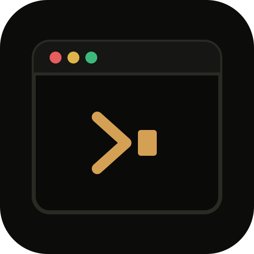

<p align="center">
  
</p>

<h1 align="center">Local workspace management</h1>

<p align="center">A localhost dashboard for the projects on your machine.</p>

**Local workspace management** (CLI **`locws`**, UI **Workspace overview**) is a loopback dashboard to start, stop, and watch allowlisted commands across several project folders. Other apps run by filesystem path — adding them to the editor is optional and can slow the machine down. The server binds to `127.0.0.1:4174` (`OVERVIEW_PORT` if that port is busy). The browser sends a command **id** only — never a shell string.

## How to use it

```bash
npx @y-corps/locws start
# or install once:
npm install -g @y-corps/locws
locws start
```

- Prints [http://127.0.0.1:4174](http://127.0.0.1:4174) — copy it into a browser. Ctrl+C stops the server.
- Same server, open a tab: `locws start --browser`. Dedicated window: `locws start --window`. Details: [npm scripts](docs/npm-scripts.md).
- If a newer npm version exists, the terminal prints it. Upgrade with `locws upgrade` (runs `npm install -g @y-corps/locws@latest`). Git clones do not nag; use `git pull` there. Testers: `npx @y-corps/locws@beta start`.

Then **Add project** → Browse or paste a path (absolute or `~/...`) → **Probe** → pick commands → **Add Project**. **Cancel** dismisses without saving. Step by step: [User guide](docs/user-guide.md).

To work on this repo instead of installing the CLI:

```bash
git clone https://github.com/y-corps8/local-workspace-management.git
cd local-workspace-management
npm start
```

## Features

- **One place for many repos** — Run, database, seed, test, and custom commands live on project cards instead of a pile of terminals. Other apps start from their folder path, so you do not have to load every project in the editor.
- **Safer than a generic runner** — The dashboard only listens on your machine (`127.0.0.1`). The browser can start a command you already allowlisted — it never sends a shell string or a path you type at run time.
- **No extra stack** — Plain Node. Users run `npx @y-corps/locws start` or `npm install -g @y-corps/locws`. Contributors use `npm start` / `start:browser` / `start:window`. No Electron, no bundler, no extra npm packages to install or keep updated.
- **A dedicated window if you want one** — `locws start --window` (or `npm run start:window`) opens a native OS WebView with the app icon (not Chrome). Closing that window stops the server. A browser tab works the same if you prefer it.
- **See what’s running** — Health pills show whether each configured port was open at the last check (refresh, not a live poll). The console streams logs and puts Yes/No on blocking prompts so you can answer without leaving the page.
- **Fits how you already work** — Buttons use npm, pnpm, yarn, or bun from each project’s `package.json`, or a custom command you add. Optional last-test cards and Expo live actions (reload, iOS, Android, …) when Metro is up.
- **Setup stays on your machine** — Add and edit projects in the portal. Packaged installs store `workspace.json` under `~/.config/locws/` (Windows `%APPDATA%\locws\`). A git clone keeps the file at the repo root (gitignored). Nothing is uploaded; the file is the whole setup.

## Requirements

- **Node.js 20.6+** (`npm test` uses `node --import`)
- No extra npm packages to install

## Screenshots

<p align="center">
  
</p>

## Security

Binds to loopback only. It can start, stop, seed, and send Metro actions for whatever you configured in setup — do not expose the dashboard port on a network interface. How to report a vulnerability: [SECURITY.md](SECURITY.md).

## Documentation

- [User guide](docs/user-guide.md) — how to use the dashboard
- [How the pieces connect](docs/README.md)
- [npm scripts](docs/npm-scripts.md)
- [workspace.json](docs/workspace-config.md)
- [Last test runs](docs/test-results.md)
- [Developers guide](docs/developers-guide/README.md) — what each source file does

AIs working in this repo should follow [AGENTS.md](AGENTS.md).

## Contributing

See [CONTRIBUTING.md](CONTRIBUTING.md). **Bugs, features, and pull requests** are public issues and PRs; report **vulnerabilities** privately via [SECURITY.md](SECURITY.md). This project follows the [Code of Conduct](CODE_OF_CONDUCT.md).

## License

[MIT](LICENSE) © y-corps
