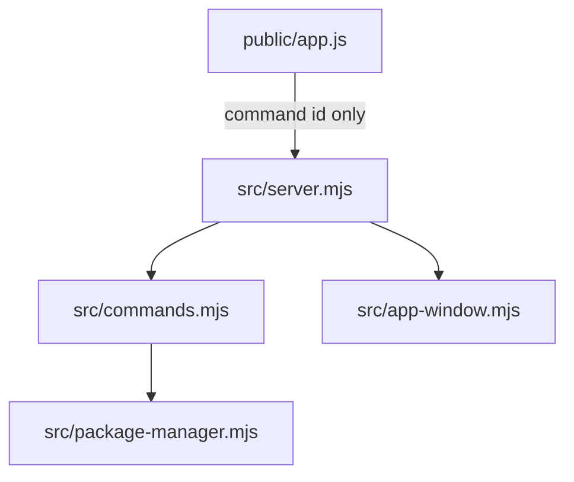

# Developers guide

Code map for this repo. User-facing behavior stays in [docs/](../README.md). Contributor rules stay in [AGENTS.md](../../AGENTS.md).

The browser / native WebView loads [`public/`](../../public/). [`src/server.mjs`](../../src/server.mjs) serves that folder, exposes `/api/*`, and runs allowlisted jobs. [`src/commands.mjs`](../../src/commands.mjs) is the config hub: paths, `workspace.json`, and the command allowlist.

```
browser / native WebView   →  public/ (UI)  →  src/server.mjs (HTTP + jobs)
                                               ├─ src/commands.mjs   (allowlist, workspace.json)
                                               ├─ src/package-manager.mjs
                                               ├─ src/app-window.mjs (--window wrapper)
                                               ├─ src/prompt.mjs     (choice / confirm from logs)
                                               └─ src/test-results.mjs (.cache + project artifacts)
```



## Path roots

| Constant / folder | Meaning |
|-------------------|---------|
| `APP_ROOT` in [`commands.mjs`](src/commands.md) | Repo root (`src/` parent). Do not reset it to `src/`. |
| `STATIC_ROOT` in [`server.mjs`](src/server.md) | [`public/`](../../public/) — `src/` and `docs/` are not served |
| `workspace.json` | Gitignored runtime config at the repo root |
| `.cache/` | Gitignored snapshots, atomic write temps, native window helpers |

Project `path` is per project: absolute or `~/...`. Leftover relative paths resolve against `APP_ROOT`.

## Run and test

| Script | What starts |
|--------|-------------|
| `npm start` | `node src/server.mjs` — prints `http://127.0.0.1:4174`, does not open a browser |
| `npm run start:browser` | Same + may `open` the loopback URL |
| `npm run start:window` | Same + native WebView; closing the window stops the server |
| `npm test` | `node --import ./test/preload.mjs --test test/*.test.mjs` |

`test/preload.mjs` sets `OVERVIEW_SKIP_WORKSPACE_LOAD=1` so tests never read or write your `workspace.json`. Details: [npm scripts](../npm-scripts.md), [test catalog](test.md).

## Pages

### `src/`

| Page | File |
|------|------|
| [server.md](src/server.md) | [`src/server.mjs`](../../src/server.mjs) |
| [commands.md](src/commands.md) | [`src/commands.mjs`](../../src/commands.mjs) |
| [package-manager.md](src/package-manager.md) | [`src/package-manager.mjs`](../../src/package-manager.mjs) |
| [env-file.md](src/env-file.md) | [`src/env-file.mjs`](../../src/env-file.mjs) |
| [job-logs.md](src/job-logs.md) | [`src/job-logs.mjs`](../../src/job-logs.mjs) |
| [metro.md](src/metro.md) | [`src/metro.mjs`](../../src/metro.mjs) |
| [prompt.md](src/prompt.md) | [`src/prompt.mjs`](../../src/prompt.mjs) |
| [origin.md](src/origin.md) | [`src/origin.mjs`](../../src/origin.mjs) |
| [open-external.md](src/open-external.md) | [`src/open-external.mjs`](../../src/open-external.mjs) |
| [sse.md](src/sse.md) | [`src/sse.mjs`](../../src/sse.mjs) |
| [test-results.md](src/test-results.md) | [`src/test-results.mjs`](../../src/test-results.mjs) |
| [merge-command.md](src/merge-command.md) | [`src/merge-command.mjs`](../../src/merge-command.mjs) |
| [argv.md](src/argv.md) | [`src/argv.mjs`](../../src/argv.mjs) |
| [app-window.md](src/app-window.md) | [`src/app-window.mjs`](../../src/app-window.mjs) |
| [app-window-shared.md](src/app-window-shared.md) | [`src/app-window-shared.mjs`](../../src/app-window-shared.mjs) |
| [app-window-darwin.md](src/app-window-darwin.md) | [`src/app-window-darwin.mjs`](../../src/app-window-darwin.mjs) |
| [app-window-linux.md](src/app-window-linux.md) | [`src/app-window-linux.mjs`](../../src/app-window-linux.mjs) |
| [app-window-win32.md](src/app-window-win32.md) | [`src/app-window-win32.mjs`](../../src/app-window-win32.mjs) |
| [overview-window.md](src/overview-window.md) | [`overview-window.py`](../../src/overview-window.py) / [`.c`](../../src/overview-window.c) / [`.cs`](../../src/overview-window.cs) |

### `public/`

| Page | File |
|------|------|
| [index.md](public/index.md) | [`public/index.html`](../../public/index.html) |
| [app.md](public/app.md) | [`public/app.js`](../../public/app.js) |
| [styles.md](public/styles.md) | [`public/styles.css`](../../public/styles.css) |
| [sw.md](public/sw.md) | [`public/sw.js`](../../public/sw.js) |
| [manifest.md](public/manifest.md) | [`public/manifest.webmanifest`](../../public/manifest.webmanifest) |
| [assets.md](public/assets.md) | [`public/assets/`](../../public/assets/) |

### Tests

| Page | File |
|------|------|
| [test.md](test.md) | [`test/`](../../test/) |

## User docs

- [User guide](../user-guide.md)
- [How the pieces connect](../README.md)
- [npm scripts](../npm-scripts.md)
- [workspace.json](../workspace-config.md)
- [Last test runs](../test-results.md)
