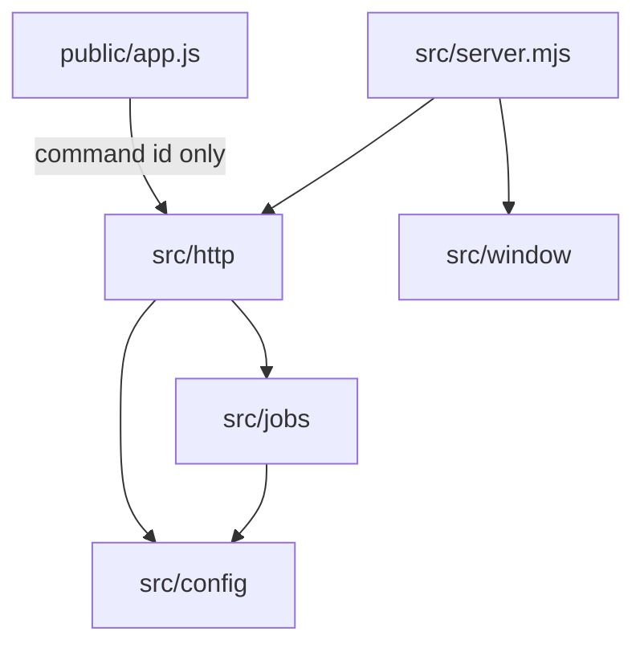

# Developers guide

Code map for this repo. User-facing behavior stays in [docs/](../README.md). Contributor rules stay in [AGENTS.md](../../AGENTS.md).

The browser / native WebView loads [`public/`](../../public/). [`src/server.mjs`](../../src/server.mjs) is the CLI: it calls [`createOverviewApp`](src/http/overview-http.md) and `listen`. [`src/config/paths.mjs`](../../src/config/paths.mjs) splits package root vs user data. [`src/config/commands.mjs`](../../src/config/commands.mjs) is the config hub: `workspace.json` and the command allowlist.

```
browser / native WebView   →  public/ (UI)  →  src/server.mjs (CLI + listen)
                                               ├─ src/http/     (static + /api/*)
                                               ├─ src/jobs/     (spawn / stdin / logs)
                                               ├─ src/config/   (allowlist, paths)
                                               ├─ src/cli/      (upgrade, OS open)
                                               └─ src/window/   (--window WebView)
```



## Path roots

| Constant / folder | Meaning |
|-------------------|---------|
| `APP_ROOT` in [`paths.mjs`](src/config/paths.md) | Directory of `package.json`. Do not set it to `src/` or `src/config/`. |
| `STATIC_ROOT` in [`overview-http.mjs`](src/http/overview-http.md) | [`public/`](../../public/) — `src/` and `docs/` are not served |
| `workspace.json` | Clone: repo root (gitignored). Packaged: `~/.config/locws/` (Windows `%APPDATA%\locws`) |
| `.cache/` | Clone: repo root. Packaged: `~/.cache/locws/`. Snapshots and native window helpers |

Project `path` is per project: absolute or `~/...`. Leftover relative paths resolve against `APP_ROOT` on clone, against the home directory when packaged.

## Run and test

| Script | What starts |
|--------|-------------|
| `npm start` | `node src/server.mjs start` — prints `http://127.0.0.1:4174` (or `OVERVIEW_PORT`), does not open a browser |
| `npm run start:browser` | Same + may `open` the loopback URL |
| `npm run start:window` | Same + native WebView; closing the window stops the server |
| `locws start` / `locws start --browser` / `locws start --window` | Same as the three scripts (published bin) |
| `locws upgrade` | Hardcoded `npm install -g @y-corps/locws@latest`; does not start the server |
| `npm test` | `node --import ./test/preload.mjs --test test/*/*.test.mjs` |

`test/preload.mjs` sets `OVERVIEW_SKIP_WORKSPACE_LOAD=1` so tests never read or write your `workspace.json`. Details: [npm scripts](../npm-scripts.md), [test catalog](test.md).

## Pages

### `src/`

| Page | File |
|------|------|
| [server.md](src/server.md) | [`src/server.mjs`](../../src/server.mjs) |
| [overview-http.md](src/http/overview-http.md) | [`src/http/overview-http.mjs`](../../src/http/overview-http.mjs) |
| [origin.md](src/http/origin.md) | [`src/http/origin.mjs`](../../src/http/origin.mjs) |
| [sse.md](src/http/sse.md) | [`src/http/sse.mjs`](../../src/http/sse.mjs) |
| [browse.md](src/http/browse.md) | [`src/http/browse.mjs`](../../src/http/browse.mjs) |
| [jobs.md](src/jobs/jobs.md) | [`src/jobs/jobs.mjs`](../../src/jobs/jobs.mjs) |
| [job-logs.md](src/jobs/job-logs.md) | [`src/jobs/job-logs.mjs`](../../src/jobs/job-logs.mjs) |
| [prompt.md](src/jobs/prompt.md) | [`src/jobs/prompt.mjs`](../../src/jobs/prompt.mjs) |
| [env-file.md](src/jobs/env-file.md) | [`src/jobs/env-file.mjs`](../../src/jobs/env-file.mjs) |
| [metro.md](src/jobs/metro.md) | [`src/jobs/metro.mjs`](../../src/jobs/metro.mjs) |
| [metro-actions.md](src/jobs/metro-actions.md) | [`src/jobs/metro-actions.mjs`](../../src/jobs/metro-actions.mjs) |
| [git-info.md](src/jobs/git-info.md) | [`src/jobs/git-info.mjs`](../../src/jobs/git-info.mjs) |
| [test-results.md](src/jobs/test-results.md) | [`src/jobs/test-results.mjs`](../../src/jobs/test-results.mjs) |
| [paths.md](src/config/paths.md) | [`src/config/paths.mjs`](../../src/config/paths.mjs) |
| [commands.md](src/config/commands.md) | [`src/config/commands.mjs`](../../src/config/commands.mjs) |
| [package-manager.md](src/config/package-manager.md) | [`src/config/package-manager.mjs`](../../src/config/package-manager.mjs) |
| [argv.md](src/config/argv.md) | [`src/config/argv.mjs`](../../src/config/argv.mjs) |
| [merge-command.md](src/config/merge-command.md) | [`src/config/merge-command.mjs`](../../src/config/merge-command.mjs) |
| [update-check.md](src/cli/update-check.md) | [`src/cli/update-check.mjs`](../../src/cli/update-check.mjs) |
| [open-external.md](src/cli/open-external.md) | [`src/cli/open-external.mjs`](../../src/cli/open-external.mjs) |
| [app-window.md](src/window/app-window.md) | [`src/window/app-window.mjs`](../../src/window/app-window.mjs) |
| [app-window-shared.md](src/window/app-window-shared.md) | [`src/window/app-window-shared.mjs`](../../src/window/app-window-shared.mjs) |
| [app-window-darwin.md](src/window/app-window-darwin.md) | [`src/window/app-window-darwin.mjs`](../../src/window/app-window-darwin.mjs) |
| [app-window-linux.md](src/window/app-window-linux.md) | [`src/window/app-window-linux.mjs`](../../src/window/app-window-linux.mjs) |
| [app-window-win32.md](src/window/app-window-win32.md) | [`src/window/app-window-win32.mjs`](../../src/window/app-window-win32.mjs) |
| [overview-window.md](src/window/overview-window.md) | [`overview-window.py`](../../src/window/overview-window.py) / [`.c`](../../src/window/overview-window.c) / [`.cs`](../../src/window/overview-window.cs) |

### `public/`

| Page | File |
|------|------|
| [index.md](public/index.md) | [`public/index.html`](../../public/index.html) |
| [theme-boot.md](public/theme-boot.md) | [`public/theme-boot.js`](../../public/theme-boot.js) |
| [app.md](public/app.md) | [`public/app.js`](../../public/app.js) |
| [js/argv.md](public/js/argv.md) | [`public/js/argv.js`](../../public/js/argv.js) |
| [js/api.md](public/js/api.md) | [`public/js/api.js`](../../public/js/api.js) |
| [js/render.md](public/js/render.md) | [`public/js/render.js`](../../public/js/render.js) |
| [js/console.md](public/js/console.md) | [`public/js/console.js`](../../public/js/console.js) |
| [js/setup.md](public/js/setup.md) | [`public/js/setup.js`](../../public/js/setup.js) |
| [js/hooks.md](public/js/hooks.md) | [`public/js/hooks.js`](../../public/js/hooks.js) |
| [js/util.md](public/js/util.md) | [`public/js/util.js`](../../public/js/util.js) |
| [js/dom.md](public/js/dom.md) | [`public/js/dom.js`](../../public/js/dom.js) |
| [js/state.md](public/js/state.md) | [`public/js/state.js`](../../public/js/state.js) |
| [js/theme.md](public/js/theme.md) | [`public/js/theme.js`](../../public/js/theme.js) |
| [styles.md](public/styles.md) | [`public/styles.css`](../../public/styles.css) |
| [sw.md](public/sw.md) | [`public/sw.js`](../../public/sw.js) |
| [manifest.md](public/manifest.md) | [`public/manifest.webmanifest`](../../public/manifest.webmanifest) |
| [assets.md](public/assets.md) | [`public/assets/`](../../public/assets/) |

### Tests

| Page | File |
|------|------|
| [test.md](test.md) | [`test/`](../../test/) |

## User docs

- [User guide](../user-guide.md)
- [How the pieces connect](../README.md)
- [npm scripts](../npm-scripts.md)
- [workspace.json](../workspace-config.md)
- [Last test runs](../test-results.md)
