# Features

What each **Workspace overview** feature does, and how to use it. For a first-time walkthrough (start → add a project → run a command), see the [user guide](user-guide.md).

## Contents

- [Start and install](#start-and-install)
  - [Start the dashboard](#start-the-dashboard)
  - [Open in a browser tab](#open-in-a-browser-tab)
  - [Dedicated window](#dedicated-window)
  - [Change the port](#change-the-port)
  - [Version](#version)
  - [Upgrade](#upgrade)
  - [Stop the server](#stop-the-server)
- [Projects](#projects)
  - [Empty dashboard](#empty-dashboard)
  - [Add a project](#add-a-project)
  - [Browse, path, and Probe](#browse-path-and-probe)
  - [Name, id, and description](#name-id-and-description)
  - [Command rows](#command-rows)
  - [Available vs selected](#available-vs-selected)
  - [Custom commands](#custom-commands)
  - [Health port](#health-port)
  - [Missing package.json](#missing-packagejson)
  - [Project cards](#project-cards)
  - [Card menu](#card-menu)
  - [Reorder cards](#reorder-cards)
  - [Filter projects](#filter-projects)
  - [Hide a project](#hide-a-project)
- [Running commands](#running-commands)
  - [Run, stop, and restart](#run-stop-and-restart)
  - [Destructive confirm](#destructive-confirm)
  - [Start primaries](#start-primaries)
  - [Unavailable commands](#unavailable-commands)
- [Console](#console)
  - [Expand, collapse, and resize](#expand-collapse-and-resize)
  - [Job tabs](#job-tabs)
  - [Filter logs](#filter-logs)
  - [Collapsed summary](#collapsed-summary)
  - [Prompt overlay](#prompt-overlay)
- [Health](#health)
  - [Health pills](#health-pills)
  - [Refresh](#refresh)
- [Settings](#settings)
  - [Open and close Settings](#open-and-close-settings)
  - [Appearance](#appearance)
  - [Show last test runs](#show-last-test-runs)
  - [Export and import](#export-and-import)
  - [Settings project list](#settings-project-list)
  - [Where Cancel and Update return](#where-cancel-and-update-return)
- [Expo](#expo)
- [Keyboard and preferences](#keyboard-and-preferences)
- [Where your setup lives](#where-your-setup-lives)

## Start and install

### Start the dashboard

**What it is.** Starts the loopback server and prints the dashboard URL. It does not open a browser.

**How to use it**

```bash
npx @y-corps/locws start
# or: npm install -g @y-corps/locws && locws start
```

Copy `http://127.0.0.1:4174` into a browser. From a git clone of this repo, use `npm start` instead of `locws`.

Details: [npm scripts](npm-scripts.md).

### Open in a browser tab

**What it is.** Same server, then opens the loopback URL in your default browser (a new tab if Chrome or Safari is already running).

**How to use it**

```bash
locws start --browser
# clone: npm run start:browser
```

Closing the tab does **not** stop the server.

### Dedicated window

**What it is.** Same server, plus a native OS WebView with the app icon (not Chrome). Closing that window stops the server.

**How to use it**

```bash
locws start --window
# clone: npm run start:window
```

`--open` is an alias of `--window`. The window needs the OS WebView tools (macOS `swiftc`, Linux WebKitGTK, Windows WebView2 + `csc`). If that is missing, the server keeps listening and logs an install hint. Install commands: [npm scripts](npm-scripts.md).

### Change the port

**What it is.** The default bind is `127.0.0.1:4174`. `OVERVIEW_PORT` picks another port when 4174 is busy.

**How to use it.** Set `OVERVIEW_PORT` to an integer from 1–65535 before start. An invalid value prints an error and exits. The bind stays on `127.0.0.1`.

### Version

**What it is.** Prints the installed `package.json` version and exits. It does not start the dashboard.

**How to use it.** `locws --version` or `locws -v` (also `locws version`). From a git clone: `node src/server.mjs --version`, or `npm start -- --version`. Help (`--help` / `-h` / `help`) still prints usage first if both flags are passed.

### Upgrade

**What it is.** Updates a global `locws` install to the latest npm release. It does not start the dashboard.

**How to use it.** Run `locws upgrade` (hardcoded `npm install -g @y-corps/locws@latest`). A packaged start may print a newer-version notice on stderr; the UI does not show an update modal. On a git clone, use `git pull` and `npm start` — `locws upgrade` is not for clones. Testers of a pre-release: `npx @y-corps/locws@beta start`.

### Stop the server

**What it is.** Shuts down the dashboard and any commands it started.

**How to use it.** In the terminal, Ctrl+C. In window mode, close the Workspace Overview window (or quit that app). The server sends SIGTERM, then SIGKILL, so child processes do not stay up.

## Projects

### Empty dashboard

**What it is.** First visit with no projects: **No projects yet**, a primary **Add project** button, the Settings gear, and a collapsed Console. The add form does not open by itself.

**How to use it.** Click **Add project** on that panel. The gear still opens Settings when there are no cards.

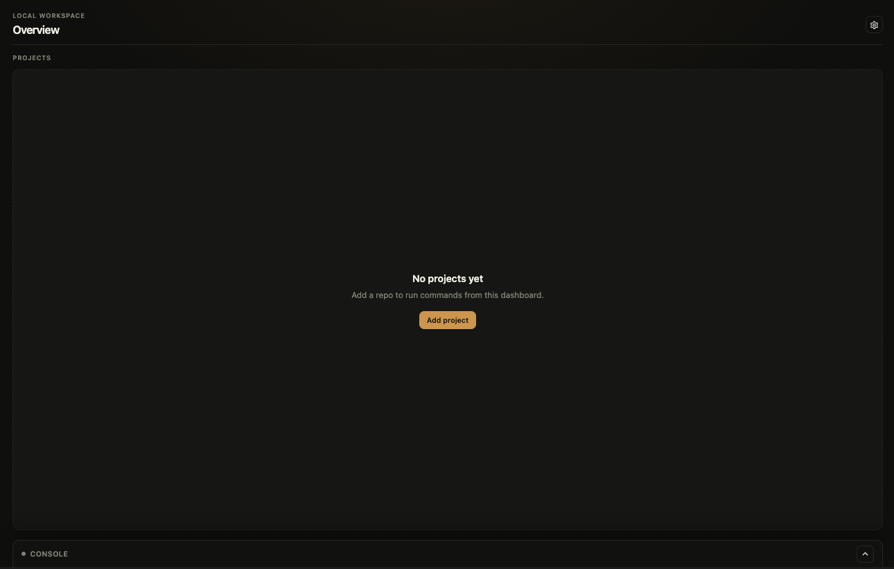

### Add a project

**What it is.** Writes one project into `workspace.json` and returns to the dashboard. There is no **Save setup**.

**How to use it**

1. Click **Add project** (empty panel, header once cards exist, or **Add project** on the Settings list).
2. Set the folder, **Probe**, pick commands, then click **Add project**.
3. **Cancel** closes without adding.

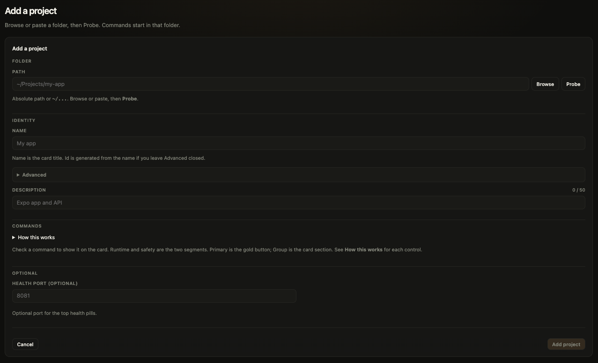

### Browse, path, and Probe

**What it is.** Commands start in the project folder. **Probe** lists scripts it finds there (usually `package.json` scripts, plus Expo scheme when present).

**How to use it**

1. **Browse** or paste an absolute path or `~/...`.
2. Click **Probe**.
3. Tick the commands you want on the card.

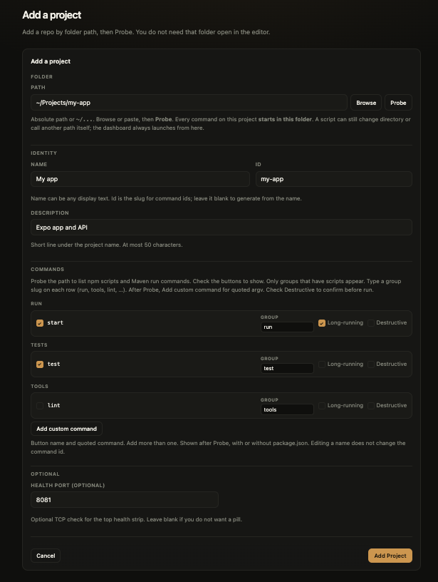

### Name, id, and description

**What it is.** **Name** is the card title (free text). **Id** is the stable slug used in command ids. **Description** is an optional subtitle (max 50 characters).

**How to use it.** Fill **Name**. Leave **Advanced** closed to generate **Id** from the name. Description is optional; a blank line is omitted on the card.

### Command rows

**What it is.** Each selected command is a two-line card. **How this works** on the form lists the same meanings.

**How to use it**

- **Drag handle** (selected rows) — reorder. Drop onto another group heading to change **Group**.
- **Checkbox** — show the command on the project card. Uncheck moves it to **Available**.
- **Once | Long-running** — Once finishes and the console shows the result. Long-running stays up; use **Stop**; the health pill can show **Running**.
- **Safe | Destructive** — Destructive asks for confirm before run and cannot be Primary.
- **Primary** — gold button on the card and **Start primaries**. Off when Destructive or unchecked. Stays unset until you pick one (not auto-selected on Probe or import).
- **Group** — section heading on the card (`run`, `test`, `lint`, or any slug).
- **Trash** — custom commands only. Probe rows have no delete.

### Available vs selected

**What it is.** Selected commands stay visible on the form. Unchecked Probe rows sit under **Available (N)** (closed, no drag).

**How to use it.** Tick a row to put it on the card. Untick to send it back to **Available**. **Add custom command** stays below Selected, above Available.

### Custom commands

**What it is.** A button for something Probe did not list (Maven, a one-off script, anything with a quoted command). Editing the label does not change the command id.

**How to use it.** After Probe, click **Add custom command**, set the button name and command. You can add more than one, with or without `package.json`. Delete a custom row with the trash icon beside **Group**.

### Health port

**What it is.** Optional port for that project’s pill in the top health strip.

**How to use it.** On the add or edit form, set **Health port**. Leave it blank if you only care about the **Running** / **Idle** job state.

### Missing package.json

**What it is.** Probe prefers a Node `package.json`. The form still lets you save a custom command without one.

**How to use it.** Create a `package.json` in the folder, or **Browse** a Node project. Or skip that and add custom commands after Probe.

### Project cards

**What it is.** One card per visible project: name, optional description, git branch (and **dirty** if the tree has uncommitted changes), a status chip, and the command buttons you picked, in groups.

**How to use it.** Cards follow the `projects` array order. The chip is **Idle**, **Running**, or **N running**. The gold button is the **Primary** when you set one; otherwise the Run group stays gold. Branch updates on load or refresh, not when a command starts. A blank description is not shown.

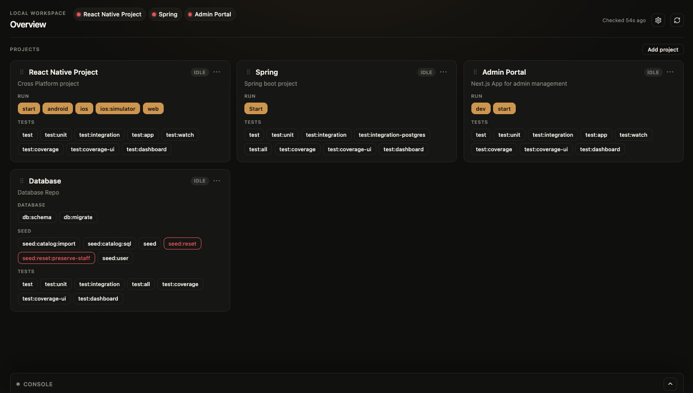

### Card menu

**What it is.** The **⋯** next to the running chip opens **Edit** or **Delete**.

**How to use it.** **Edit** opens the Settings form; **Cancel** or **Update project** from a card Edit returns to the dashboard. **Delete** uses the same confirm as Settings **Remove**.

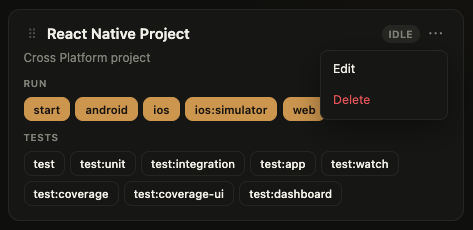

### Reorder cards

**What it is.** Dashboard card order is the project list order. Hidden projects stay in the list but are omitted from cards.

**How to use it.** Drag the handle on a card (or on a Settings row). The new order saves on drop.

### Filter projects

**What it is.** Client-only search over name, id, description, command label or script, and git branch. It is not saved to `workspace.json`.

**How to use it.** Type in **Filter projects**. `/` focuses the field (ignored while Settings is open). Escape in the field clears it. Zero matches: **No projects match** (no Add button there). The filter hides when there are no visible projects. Every command group on a matching card still shows all of its buttons.

### Hide a project

**What it is.** **Show on dashboard** hides a project without deleting it (`hidden: true` in `workspace.json`).

**How to use it.** Open Settings, uncheck **Show on dashboard** on that row. The project stays in Settings but is omitted from cards, health pills, and last-test cards. If every project is hidden, the dashboard is empty and Settings stays available — that is not first-run.

## Running commands

### Run, stop, and restart

**What it is.** A card button starts the allowlisted command for that project. The browser sends a command **id** only — never a shell string.

**How to use it.** Click the command. While it runs, that button stays highlighted; click it again to show that job in **Console**. Use **Stop**, **Restart**, or **Stop all** (when more than one command is running). **Stop all** is on the Console chrome when Console is expanded.

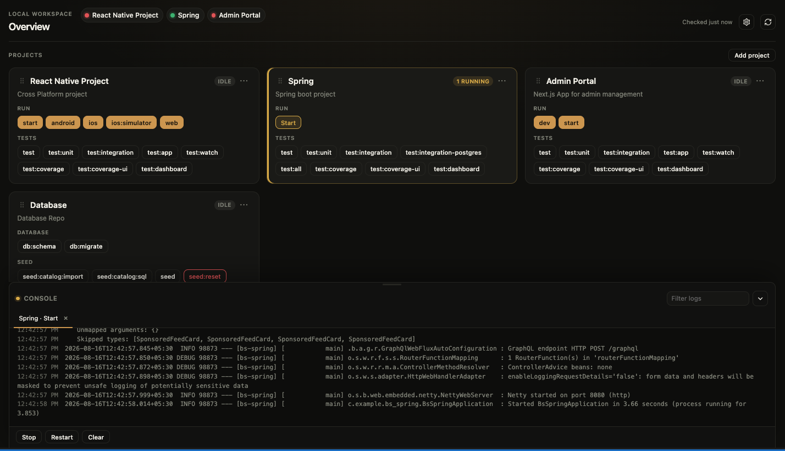

### Destructive confirm

**What it is.** A command marked **Destructive** asks before it runs.

**How to use it.** Click the red button, then **Cancel** or **Run**.

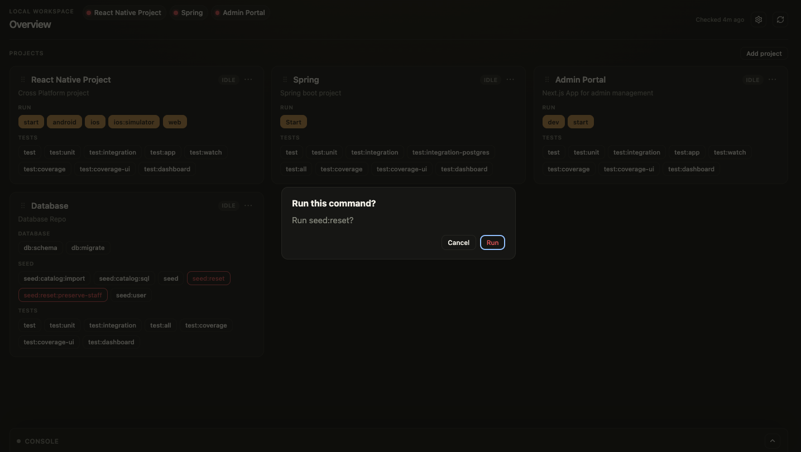

### Start primaries

**What it is.** Starts every visible idle **Primary** at once. There is no “run all commands” action.

**How to use it.** Set **Primary** on a selected **Safe** command on each project you want. Click **Start primaries** in the Projects heading. Hidden projects and already-running primaries are skipped.

### Unavailable commands

**What it is.** Package-manager buttons (`npm` / `pnpm` / `yarn` / `bun`) disable when the folder or `package.json` is missing, or the script is not in that file. Custom `argv` commands only need the folder to exist.

**How to use it.** The card shows a short warning on a disabled button. Fix the path or `package.json`, or replace the button with a custom command.

## Console

### Expand, collapse, and resize

**What it is.** A log dock at the bottom of the dashboard. It stays dark in both themes. Height and collapsed state persist in this browser.

**How to use it.** Click the Console chevron, or `Ctrl` / `⌘` + `J` (ignored while Settings is open). Drag the handle above Console to resize — height follows only while you hold the pointer; it locks when you release. ArrowUp / ArrowDown on that handle also change height. Collapsing pauses log painting (commands keep running); expand reloads the current job. First visit with no stored preference starts collapsed when there are no jobs.

### Job tabs

**What it is.** Each run gets a tab (`Project · command`).

**How to use it.** Switch tabs to change which log you are reading. **Clear** clears the current log. Close a tab with **×**.

### Filter logs

**What it is.** A search over the visible log. Kept in this browser until you clear the field.

**How to use it.** Expand Console. **Filter logs** is on the title row only while it is open. Clear the field to drop the filter.

### Collapsed summary

**What it is.** While Console is collapsed, the title row still shows which command is running.

**How to use it.** Read `Project · command`, plus **+ N more** if several jobs are up, and **waiting** if a prompt is showing. **Stop all** stays hidden until you expand.

### Prompt overlay

**What it is.** When a command asks Yes / No, a choice, or Press Enter, buttons appear over that log. There is no box to type into. Free-text prompts are out of scope.

**How to use it.** Click an overlay button. Those choices are not on the toolbar. npm / Gradle `>` log prefixes are not treated as choice menus; Inquirer menus use `❯`.

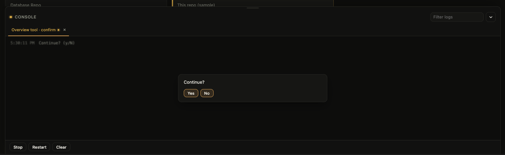

## Health

### Health pills

**What it is.** Colored pills next to **Overview**. They are a snapshot, not a live port poll.

**How to use it.** Read gold **Running** while a long-running command for that project from this dashboard is running, green **Port open** if only that port was open on the last check, muted **Idle** otherwise (not a failure). The card chip stays **Idle** when only the port is open. Click a pill to scroll to that project card.

### Refresh

**What it is.** A one-shot status check (health pills, git branch, running jobs). Starting or stopping a long-running command already rebuilds light status.

**How to use it.** Click the refresh icon to the right of Settings (shown when projects exist) for a TCP check you did not just trigger from a command. **Checked … ago** is when that last snapshot ran. A short timer may rewrite that string only — it does not poll.

## Settings

### Open and close Settings

**What it is.** A full page for appearance, last-test toggle, export/import, and the project list. The topbar, cards, last-test section, and Console are hidden.

**How to use it.** Click the gear, or `Ctrl` / `⌘` + `,` (toggles the list; ignored while an add/edit form is open). The title is **Settings** on the list, **Add a project** on the add form, and **Edit {name}** on the edit form. Close, Escape, or `Ctrl` / `⌘` + `,` returns to the dashboard.

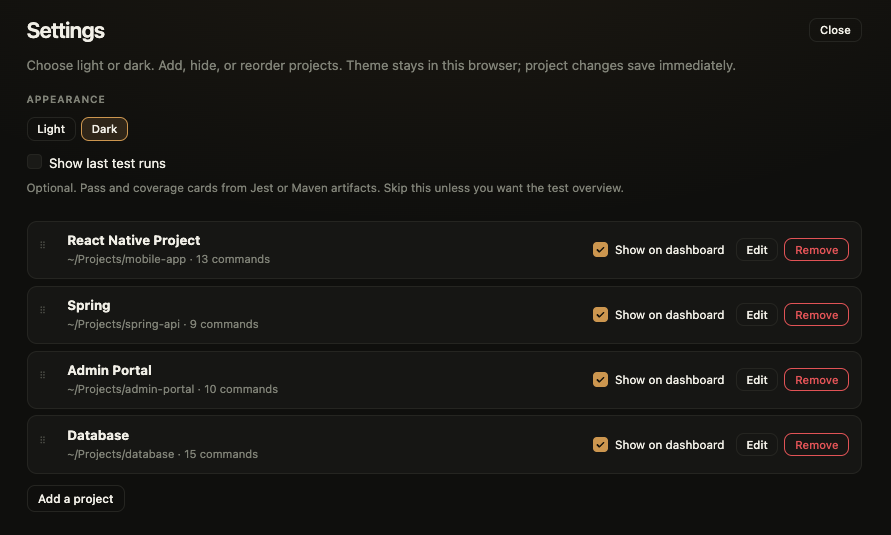

### Appearance

**What it is.** **Light** or **Dark** for the page around the Console. Default is Dark. It does not follow `prefers-color-scheme`. Theme is this browser only (`localStorage`), not `workspace.json`.

**How to use it.** Open the Settings list (hidden on add/edit). Click **Light** or **Dark**. The change persists immediately. The Console dock stays dark in both themes.

### Show last test runs

**What it is.** Optional pass/fail cards above **Projects**. Off by default. Not shown on first-run or add/edit forms.

**How to use it.** On the Settings list (when you have at least one project), tick **Show last test runs**. The checkbox saves immediately. Until a test finishes, that section is one empty line — not a row of rings. Run a test command from a card; the overview updates when that run finishes. A passed run is a full green ring; a failed run is a full red ring. The number in the middle is the pass rate. Projects with no report yet are omitted. Click a last-test card to open that test job in Console if it is still listed, or to run the first Tests command on that project (confirm if it is destructive). An empty compact row is not clickable.

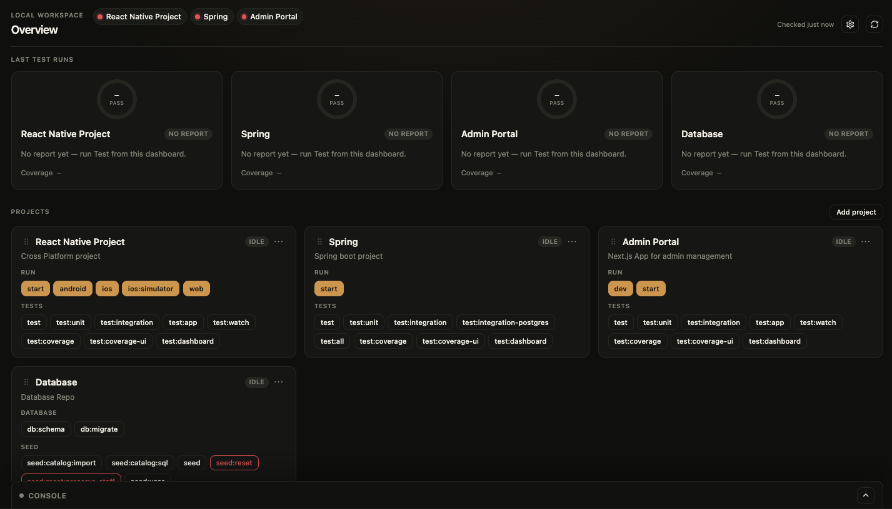

How artifacts are merged: [Last test runs](test-results.md).

### Export and import

**What it is.** Download or replace the live `workspace.json`. Theme is not in that file.

**How to use it.** On the Settings list (hidden on add/edit), **Export workspace** downloads the current file. **Import workspace** asks **Replace workspace?** then replaces it. Invalid JSON keeps the current file.

### Settings project list

**What it is.** Every project, including hidden ones, with **Add project** even when the list is empty.

**How to use it.** Drag to reorder. **Show on dashboard** hides without deleting. **Edit** opens the form. **Update project** does not need Probe when the path is unchanged. Changing the path still needs Probe. Confirmed **Remove** persists immediately; if no projects remain, stay on Settings with the empty list and **Add project**. Path is edited on this form, not on the card.

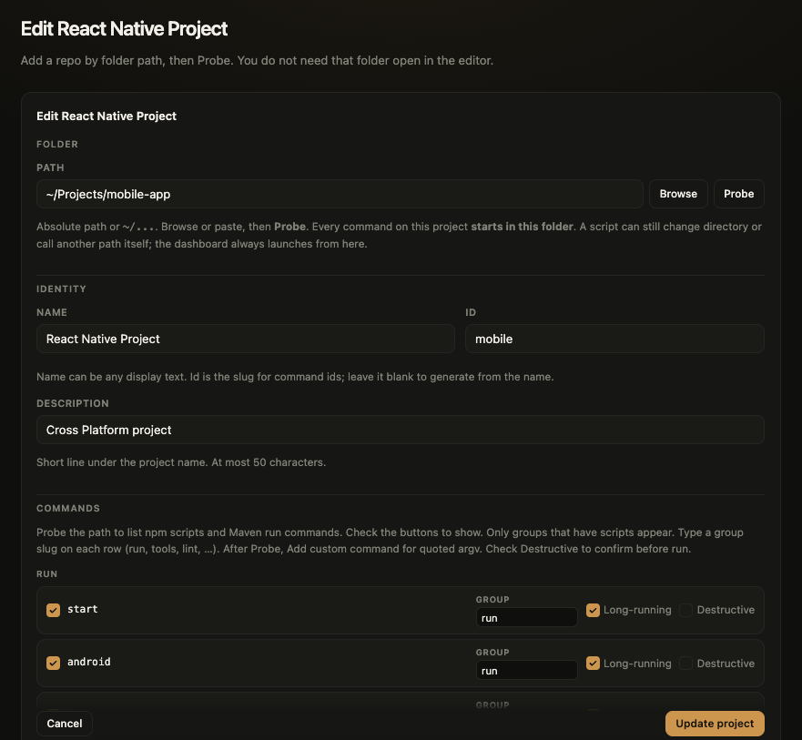

### Where Cancel and Update return

**What it is.** Add and Edit remember whether you opened them from the dashboard or from Settings.

**How to use it**

- **Cancel** on a form opened from the dashboard closes to the dashboard.
- **Cancel** on a form opened from Settings returns to the Settings list (including when there are still no projects).
- **Update project** from Settings Edit stays on the Settings list.
- **Update project** from a card **⋯** Edit returns to the dashboard.

## Expo

**What it is.** Live actions for an Expo / Metro job started from this dashboard. The Metro port is read from that job’s logs (not a setup field). The iOS / Android scheme comes from Probe (`app.json` `expo.scheme`, default `app`).

**How to use it.** Start the Expo command from the card. While that job is running, the Console toolbar shows **Reload**, **Menu**, **iOS**, **Android**, **Web**, **Debugger**, **Editor**, **Inspect**, **Perf**.

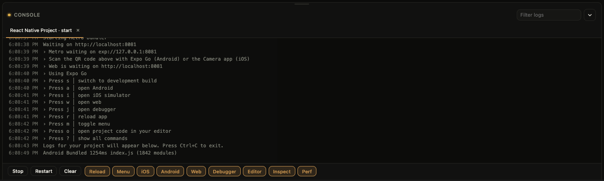

## Keyboard and preferences

**What it is.** A few shortcuts on the dashboard, plus browser-only preferences. Letter shortcuts are ignored while you are typing (except Escape). `Ctrl` / `⌘` + `F` is not bound.

**How to use it**

| Shortcut | Action |
|----------|--------|
| `Ctrl` / `⌘` + `J` | Show or hide Console (ignored while Settings is open) |
| `Ctrl` / `⌘` + `,` | Toggle the Settings list (ignored while the add/edit form is visible) |
| `/` | Focus **Filter projects** (ignored while Settings is open) |
| Escape | Close Settings, or clear the project filter when that field is focused |

Stored in this browser (`localStorage`; private-mode failures are ignored):

- `overview.theme` — Light or Dark
- `overview.consoleHeight` — Console height
- `overview.consoleCollapsed` — Console collapsed
- `overview.logFilter` — log filter (clear the field to drop it)

`workspace.json` holds projects, commands, hide flags, and **Show last test runs**. Theme is never written there.

## Where your setup lives

**What it is.** All projects and command buttons live in one `workspace.json` on your machine. Nothing is uploaded.

**How to use it**

| How you run | Live `workspace.json` |
|-------------|------------------------|
| Git clone (`npm start`) | `<repo>/workspace.json` (gitignored) |
| `npx` / `npm install -g` | `~/.config/locws/workspace.json` (Windows `%APPDATA%\locws\workspace.json`) |

Startup prints `Workspace file  …`. Clone and packaged installs do not share a file. Set `OVERVIEW_DATA_DIR` to put both `workspace.json` and `.cache/` under one folder.

The server binds **loopback only** (`127.0.0.1`). Do not expose the dashboard port on a network interface. Anyone who can reach it can start or stop whatever you allowlisted.

Field reference: [workspace.json](workspace-config.md).
