# User guide

This page is how to use **Workspace overview**: start it, add your projects, run commands, and read the console. Setup stays on your computer.

## 1. Start

Install and run the CLI:

```bash
npx locws start
# or: npm install -g locws && locws start
```

Copy the address it prints (`http://127.0.0.1:4174`) into a browser. If that port is busy, start with `OVERVIEW_PORT` set to another port.

- Same app in a new browser tab: `locws start --browser`
- Its own window: `locws start --window` — closing that window stops the app
- Upgrade a global install: `locws upgrade`

From a git clone of this repo, `npm start` / `start:browser` / `start:window` are the same server. Details: [npm scripts](npm-scripts.md).

In the terminal, Ctrl+C stops it.

## 2. Empty dashboard

The first time, you see **No projects yet** and a primary **Add project** button. The gear in the header is **Settings**. **Console** stays collapsed at the bottom. The add form does not open by itself.

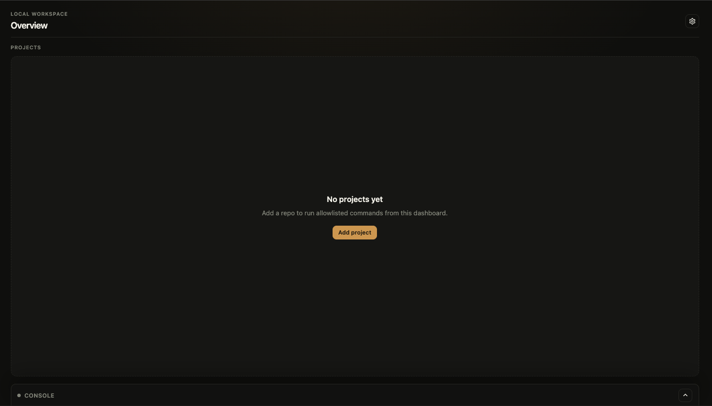

## 3. Add a project

Click **Add project** (on the empty panel, or **Add project** in the header once you already have cards).

1. Set **Path**: **Browse** or paste a folder (`~/Projects/my-app` or a full path).
2. Click **Probe**. That lists commands it finds in that folder.
3. Fill **Name**. **Id** can stay blank. **Description** is optional (short line on the card).
4. Tick the commands you want on the card. Set **Group** on a row if you want a different section (for example `run`, `test`, `lint`).
5. Optional: **Add custom command** for something Probe did not list.
6. Optional: a **Health port** if you want a pill for that project at the top of the page.
7. Click **Add Project**.

**Cancel** closes without adding.

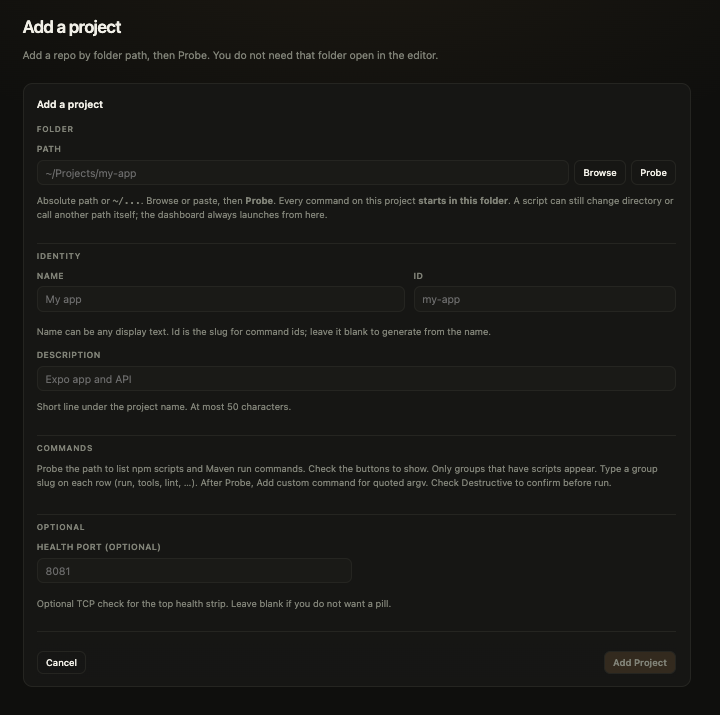

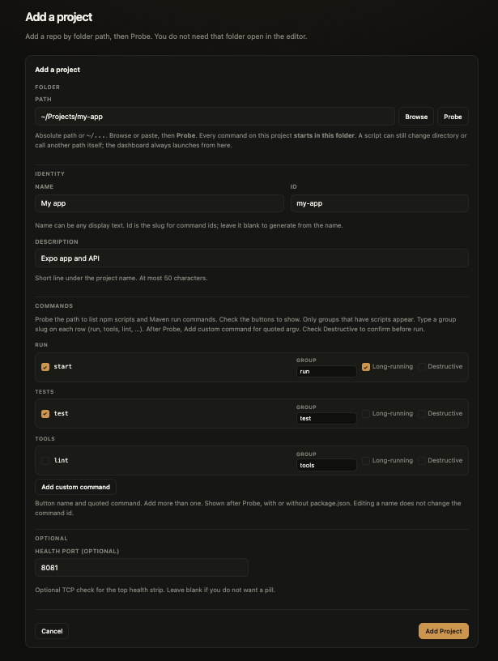

## 4. Your projects

Cards show the commands you picked, in groups. Each card has an **idle** or **running** chip. Drag the handle to change order. A blank description is not shown on the card.

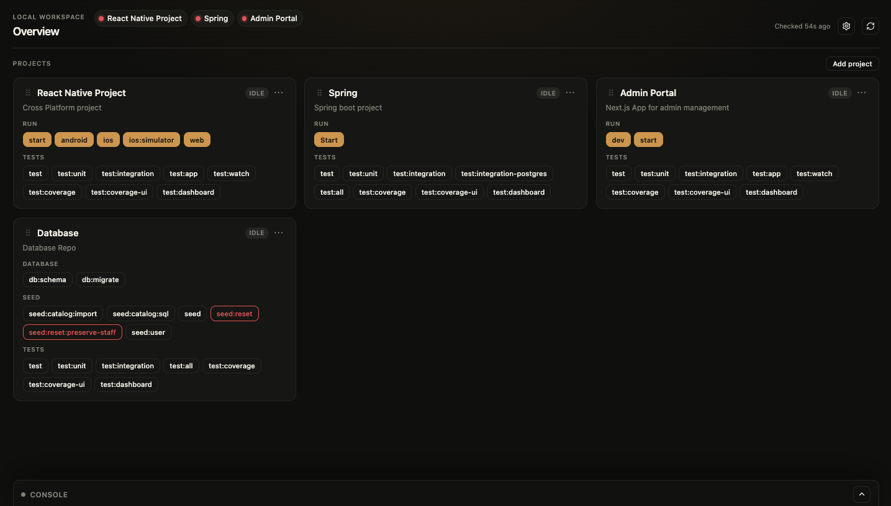

The **⋯** menu on a card is **Edit** or **Delete**.

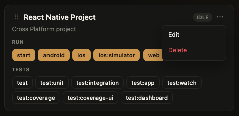

## 5. Run and stop

Click a command on a card. While it is running, that button stays highlighted; click it again to show that job in **Console**. Use **Stop**, **Restart**, or **Stop all** (when more than one command is running).

Red buttons ask you to confirm first: **Cancel** or **Run**.

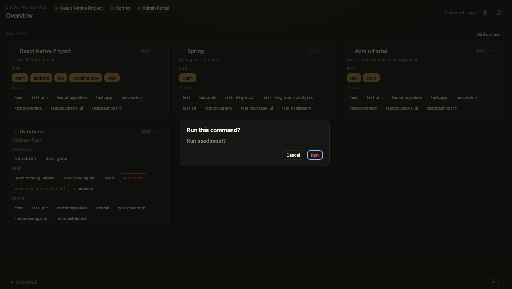

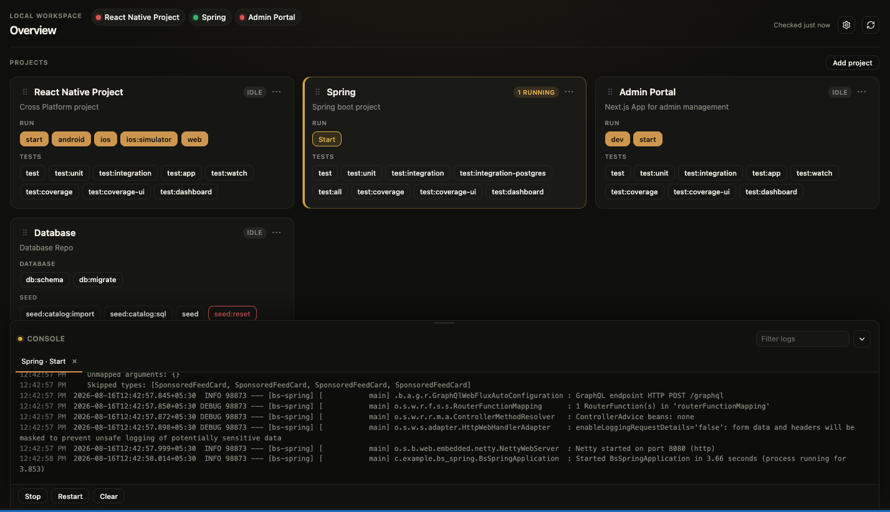

## 6. Console

Click the Console chevron to expand it. Drag the handle above Console to resize — height follows only while you hold the pointer; it stays put when you release. While it is open, **Filter logs** is on the title row. Collapsing Console pauses painting (commands keep running); expand reloads the current job’s log.

Each run gets a tab (`Project · command`). Switch tabs to change which log you are reading. **Clear** clears the current log. Close a tab with **×**.

If a command asks a question (Yes / No, a choice, or Press Enter), answer on the overlay over the log. Those buttons are not on the toolbar. There is no box to type into.

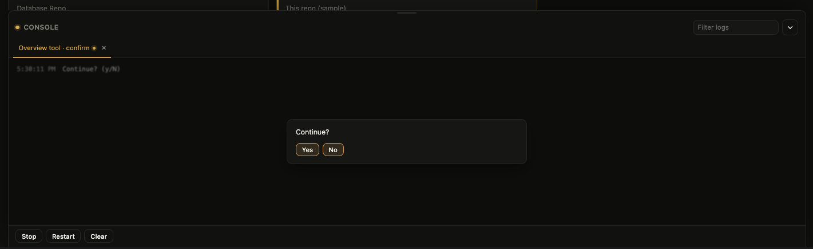

## 7. Health

The colored pills next to **Overview** turn green when you start a long-running command for that project from this dashboard, and they update again when that command stops. They are not a live port poll. Click refresh when you want a TCP check you did not just start or stop. **Checked … ago** is when that last snapshot ran.

## 8. Settings

Open the gear. The sheet title is **Settings**.

- **Appearance** — **Light** or **Dark** (default is Dark).
- **Show last test runs** — only listed when you have at least one project.
- Project rows — drag to reorder, **Show on dashboard** to hide a project without deleting it, **Edit**, **Remove**.
- **Add a project** at the bottom.

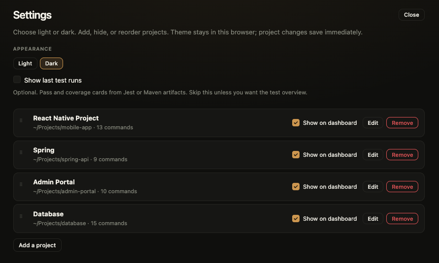

**Edit** opens the same kind of form as add, with **Update project** instead of **Add Project**.

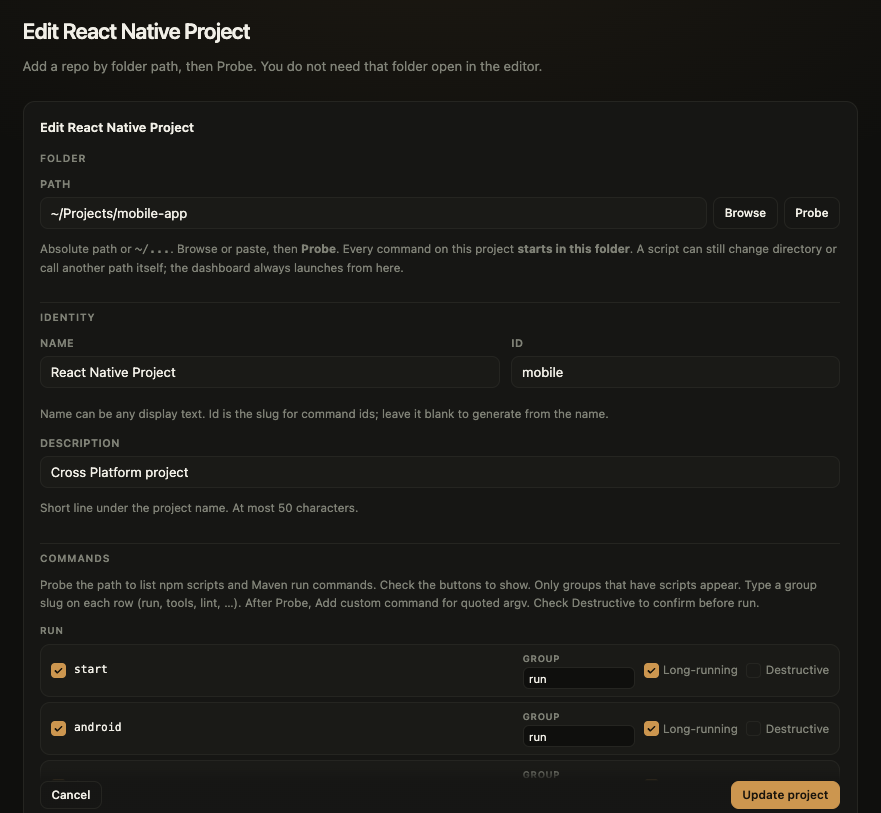

## 9. Last test runs

In Settings, turn on **Show last test runs** if you want pass/fail cards above **Projects**. Run a test command from a card; the overview updates when that run finishes.

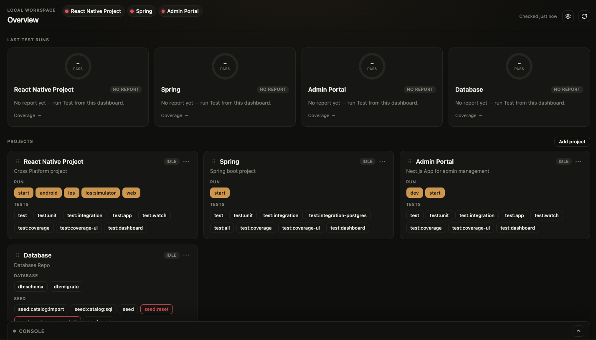

## 10. Expo

If you start an Expo app from a card, extra buttons appear on the Console toolbar while that job is running: **Reload**, **Menu**, **iOS**, **Android**, **Web**, **Debugger**, **Editor**, **Inspect**, **Perf**.

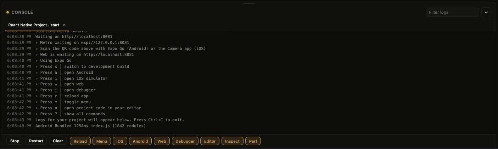
